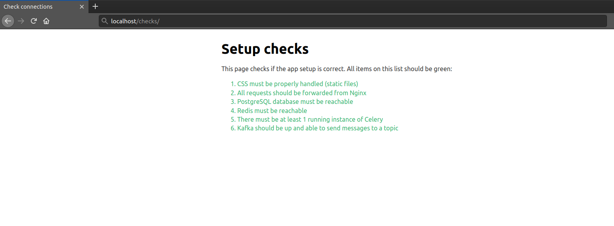

# Devops challenge - Giant Steps Capital
Congratulations and thanks for applying.

We designed a simple devops problem so you can display your skills.
All the information needed to solve the challenge is displayed below.

## About the challenge

We will provide you with a toy-Django-application, written in Python 3.8.5.

This app has a traditional Relational Database integration (PostgreSQL), but it
also integrates with some other services. Your task is to setup all the
services so that the system can corrrectly run both in the development and in
the production environments.

Also, develop a continuous integration process using the tool you prefer (it
could be Gitlab CI, Github Actions, Jenkins or any other CI tool). After that,
run the application in a production environment (use a cloud service of your
choice, such as AWS free tier, Heroku, GCP free tier, Azure or any other cloud
services provider).

The application contains some tests and it should be passing before build and deploy the application on CI process.
You will be able to run the test using the bellow command

```
docker-compose -p test run -p 8000 --rm app python manage.py test
```

Assuming that your application container was named as 'app'


## Requirements
You must use Docker to manage all the components, and all Docker images must be
either available at DockerHub or provided by you as a Dockerfile.

To achieve your goal, you should write:
- one or more docker-compose or kubernetes configuration file(s) for setting up:
    - the Django application;
    - a PostgreSQL server;
    - the Celery application;
    - a Redis server (to be used as the Celery application Broker);
    - Kafka;
    - Nginx, serving the application in port 80;
- one or more configuration file(s) for Nginx.

It's crucial that the `docker-compose` config file follows the good practices
and that its services respect startup dependencies between each other.

In order to run the Django application, all you need to do is:
1. Install the correct Python version (3.8.5)
2. Install all the dependencies with this command:
```bash
pip install -r requirements.txt
```
3. Run a local server with the command (in the app directory):
```bash
gunicorn devops_001.wsgi:application --bind 0.0.0.0:8000 --workers=4 --reload
```

Don't forget the application must run from inside a Docker container.

The Django application requires access to some environment variables to function
properly. The values of those variables must be treated as confidential, you
should take this into consideration when providing them to the system
components.

See in the table below the list of variables and its roles.

| Variable          | Role                                                                                  |
|-------------------|------------------------------------------------------------------------------------   |
| POSTGRES_DB       | Defines the application database name in the PostgreSQL server                        |
| POSTGRES_USER     | Defines the username for connecting to the PostgreSQL server                          |
| POSTGRES_PASSWORD | Defines the password for connecting to the PostgreSQL server                          |
| DATABASE_HOST     | Defines the URL for connecting to the PostgreSQL server                               |
| DATABASE_PORT     | Defines the port for connecting to the PostgreSQL server                              |
| REDIS_HOST        | Defines the URL for connecting to the Redis server                                    |
| KAFKA_HOST        | Defines the URL for the Kafka Broker                                                  |
| KAFKA_PORT        | Defines the port for the Kafka Broker                                                 |

## The /checks page
To validate the comunication between all the system services and also
the correct setup of Nginx, the Django application has a `/checks` URL that
tests the comunication between the application and the other components. Just
run the Django application server and access it in your browser in the URL
`localhost:8000/checks` (when you set Nginx up to serve your app, the URL should
be `localhost/checks` since it will serve in the port 80).

The page shows an ordered list with an item for each configuration step. Each
item will be green if its component test succeeds. This is what your page should
look like at the end of your solution:



It's up to you wether you'll follow the sequence proposed in the checks page or
not - it's import, though, once the configuration of all components is done,
all the items in the list are green.

### Important
When configuring Nginx, please include a `proxy_set_header` directive setting
using-nginx "true" header before passing the request to Django. This header will
be used by the app to check if Nginx is up and running. Without this header, the
app won't be able to detect Nginx and therefore the check list will never be all
green.

Because of this, your Nginx configuration file should look similar to this:
```nginx
# ...
proxy_set_header using-nginx "true";
# ...
```

## Logs
Each component must have its log made available somehow (you shall decide your
favorite way to do that, just remember to explain your solution).

## Delivery instructions
To deliver your solution, provide a Git repository and grant access to the user [rafalee](https://github.com/rafalee) and send an email with the repository’s link to the same email address that last contacted you..
Include a README file giving detailed execution instructions in a clear and
concise fashion. If you consider it needed, justify shortly the main decisions
you made in the process.
